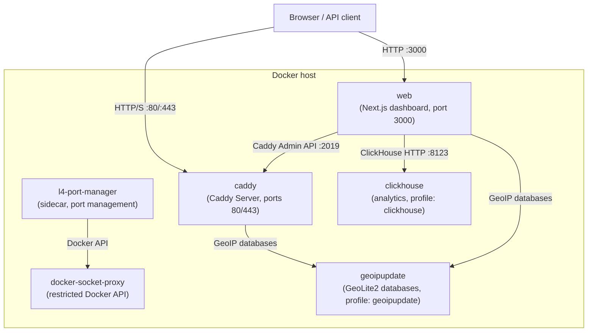

Caddy Proxy Manager (CPM) is a browser-based control plane for [Caddy Server](https://caddyserver.com/). Instead of hand-editing Caddyfiles or JSON configs, you manage reverse proxies, TLS certificates, WAF rules, geo blocking, mTLS, and traffic analytics through a single dashboard built on Next.js 16, React 19, shadcn/ui, Drizzle ORM, and TypeScript. Every configuration change is applied to Caddy's Admin API in real time and recorded in a searchable audit log. A full REST API under `/api/v1/` exposes all resources for automation and CI/CD workflows.

<CardGroup cols={2}>
  <Card title="Quick start" icon="rocket" href="/quickstart">
    Deploy CPM with Docker Compose and create your first proxy host in minutes.
  </Card>
  <Card title="Proxy hosts" icon="network-wired" href="/features/proxy-hosts">
    Reverse proxies with load balancing, health checks, and location rules.
  </Card>
  <Card title="WAF" icon="shield" href="/security/waf">
    Coraza WAF with OWASP Core Rule Set — block SQLi, XSS, LFI, and RCE per host.
  </Card>
  <Card title="API reference" icon="code" href="/api/overview">
    Full REST API with Bearer token auth and interactive OpenAPI 3.1.0 docs.
  </Card>
</CardGroup>

## Features

<CardGroup cols={2}>
  <Card title="Reverse proxy hosts" icon="network-wired" href="/features/proxy-hosts">
    HTTP/HTTPS proxies with custom headers, multiple upstreams, eight load-balancing policies, active/passive health checks, retries, and an enable/disable toggle.
  </Card>
  <Card title="L4 TCP/UDP proxying" icon="diagram-project" href="/features/l4-proxy-hosts">
    Layer 4 stream proxying with TLS SNI matching, proxy protocol v1/v2, load balancing, health checks, and per-host geo blocking. Automatic Docker Compose port management via a sidecar.
  </Card>
  <Card title="Location rules" icon="route">
    Path-based routing to different upstreams within a single proxy host — for example `/api/*` to one backend and `/ws/*` to another.
  </Card>
  <Card title="Redirect and rewrite" icon="arrow-right-arrow-left">
    Per-host redirect rules (301/302/307/308) and path prefix rewriting without additional configuration.
  </Card>
  <Card title="TLS certificates" icon="certificate" href="/features/certificates">
    Automatic HTTPS via Caddy ACME (Let's Encrypt / ZeroSSL), custom certificate import with expiry monitoring, and a built-in CA for issuing and revoking internal client certificates.
  </Card>
  <Card title="Web Application Firewall" icon="shield" href="/security/waf">
    Coraza WAF with optional OWASP Core Rule Set covering SQLi, XSS, LFI, and RCE. Per-host enable/disable, global and per-host rule suppression, and custom SecLang directives.
  </Card>
  <Card title="Geo blocking" icon="earth-americas" href="/security/geo-blocking">
    Block or allow traffic by country, continent, ASN, CIDR range, or exact IP per proxy host. Allow rules override block rules. Fail-closed mode and custom response codes.
  </Card>
  <Card title="Mutual TLS (mTLS)" icon="lock" href="/security/mtls">
    Issue, track, and revoke client certificates using the built-in CA. Path-based RBAC lets you restrict routes to specific certificate roles (for example `/admin/*` requires the "ops" role).
  </Card>
  <Card title="Forward auth portal" icon="door-open" href="/security/forward-auth">
    Built-in identity provider that protects proxy hosts without an external IdP. Supports credential and OAuth login, user groups, and per-host access control with excluded paths.
  </Card>
  <Card title="Access lists" icon="list-check" href="/features/access-lists">
    Multi-account HTTP basic auth protection (bcrypt-hashed) that can be assigned per proxy host.
  </Card>
  <Card title="Traffic analytics" icon="chart-line" href="/advanced/analytics">
    Live traffic charts, protocol breakdown, country map, top user agents, and a blocked-request log with configurable time ranges. Powered by ClickHouse with 90-day TTL retention.
  </Card>
  <Card title="OAuth / SSO" icon="key" href="/advanced/oauth-sso">
    OAuth2/OIDC authentication with any compliant provider (Authentik, Keycloak, Auth0, and others). Account linking from the profile page.
  </Card>
  <Card title="DNS providers" icon="globe" href="/advanced/dns-providers">
    DNS-01 challenge support for wildcard certificates across twelve providers: Cloudflare, Route 53, DigitalOcean, Duck DNS, Hetzner, Vultr, Porkbun, GoDaddy, Namecheap, OVH, IONOS, and Linode. Credentials are encrypted at rest with AES-256-GCM.
  </Card>
  <Card title="Instance sync" icon="arrows-rotate" href="/advanced/instance-sync">
    Master/slave configuration sync for multi-instance deployments. The master pushes proxy hosts, certificates, access lists, and settings to slaves on every change.
  </Card>
  <Card title="Authentik integration" icon="plug">
    Forward-auth SSO per proxy host with configurable header forwarding and protected paths, using Authentik as the upstream identity provider.
  </Card>
  <Card title="REST API and API tokens" icon="code" href="/api/overview">
    Full REST API at `/api/v1/` with Bearer token auth. Interactive OpenAPI 3.1.0 docs at `/api-docs`. Create tokens with optional expiration for programmatic access.
  </Card>
  <Card title="Audit log" icon="clock-rotate-left" href="/administration/audit-log">
    Searchable configuration change history with user attribution and pagination.
  </Card>
  <Card title="User management" icon="users" href="/administration/user-management">
    Admin page for managing users: edit roles, status, and profiles; disable or delete accounts; search and filter. Organize users into groups for forward auth access control.
  </Card>
</CardGroup>

## Architecture

CPM runs as a set of Docker containers that communicate over an internal bridge network (`caddy-network`). Two containers are always present; two more are optional and activated via Docker Compose profiles.

| Container | Image | Purpose |
|-----------|-------|---------|
| `caddy-proxy-manager-web` | `ghcr.io/fuomag9/caddy-proxy-manager-web` | Next.js dashboard and REST API. Reads/writes SQLite via Drizzle ORM. Pushes config to Caddy Admin API. |
| `caddy-proxy-manager-caddy` | `ghcr.io/fuomag9/caddy-proxy-manager-caddy` | Custom Caddy build with Coraza WAF, geo blocking, and L4 proxy modules. Handles all inbound traffic. |
| `caddy-proxy-manager-l4-ports` | `ghcr.io/fuomag9/caddy-proxy-manager-l4-port-manager` | Sidecar that watches L4 port changes and recreates the Caddy container to apply new port bindings. Uses a restricted Docker socket proxy. |
| `caddy-proxy-manager-docker-proxy` | `tecnativa/docker-socket-proxy` | Restricts Docker API surface available to the L4 port manager. |
| `caddy-proxy-manager-clickhouse` _(optional)_ | `clickhouse/clickhouse-server` | Analytics database for traffic and WAF events. Activated with the `clickhouse` Compose profile. |
| `geoipupdate` _(optional)_ | `ghcr.io/maxmind/geoipupdate` | Downloads and periodically refreshes MaxMind GeoLite2 databases. Activated with the `geoipupdate` Compose profile. |

Data is stored in Docker named volumes shared between containers:

| Volume | Contents |
|--------|----------|
| `caddy-manager-data` | SQLite database and certificate files |
| `caddy-data` | Caddy's ACME certificate cache |
| `caddy-config` | Caddy's runtime configuration |
| `caddy-logs` | Caddy access logs (read by the web container for analytics) |
| `geoip-data` | MaxMind GeoLite2 databases (shared read-only with web and Caddy) |
| `clickhouse-data` | ClickHouse analytics data |

## User roles

CPM has three roles with increasing privileges. New accounts default to the **User** role. The initial admin account is created from the `ADMIN_USERNAME` and `ADMIN_PASSWORD` environment variables.

| Capability | Viewer | User | Admin |
|------------|:------:|:----:|:-----:|
| Log in to the dashboard | Yes | Yes | Yes |
| View own profile | Yes | Yes | Yes |
| Access forward-auth-protected apps (when granted) | Yes | Yes | Yes |
| Manage proxy hosts, certificates, and access lists | No | No | Yes |
| Manage users, groups, and settings | No | No | Yes |
| View analytics, audit log, and API docs | No | No | Yes |
| Create and manage API tokens | No | No | Yes |
| Access the REST API (`/api/v1/`) | No | No | Yes |

<Note>
  Forward auth access is separate from role. All roles must be explicitly granted access to each protected host via the forward auth access list — even admin accounts.
</Note>
